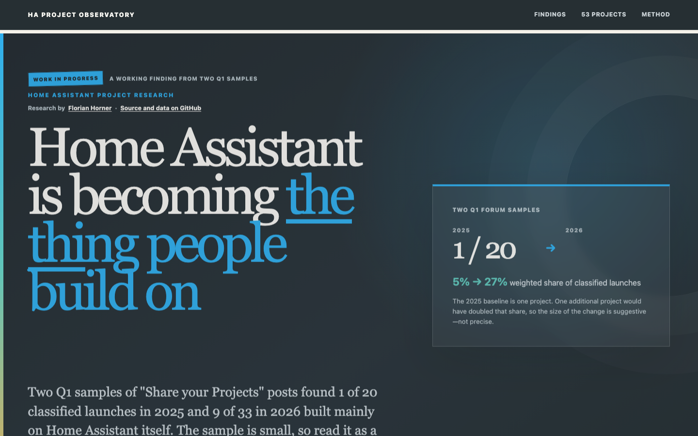

# HA Project Observatory

<a href="https://florianhorner.github.io/ha-project-observatory/">
  
</a>

[Read the interactive article](https://florianhorner.github.io/ha-project-observatory/)
and explore all 53 classified launches.

Current release: [v1.1.0](https://github.com/florianhorner/ha-project-observatory/releases/tag/v1.1.0)

No product, no newsletter, no service. I read the projects because I enjoyed
them, built the explainer to see the shape of it, and published both.

The [Home Assistant community thread](https://community.home-assistant.io/t/are-home-assistant-projects-shifting-from-connecting-things-to-extending-home-assistant-itself-data-a-clicky-clicky-explainer-inside/1021079)
shaped v1.1. @RedKing and @stevemann challenged the purpose, definition,
hardware scope and AI-disclosure limit.

I reviewed two Q1 samples from the Home Assistant Community's
"Share your Projects" forum. In the 2025 sample, 1 of 20 classified integration
launches built mainly on Home Assistant itself. In 2026, 9 of 33 did.

This is a working finding, not a census. The 2025 baseline is one project, and I
classified the posts without a second reviewer. Changes in forum traffic or
posting habits may explain part of the difference. The article publishes the
records and source links so other people can inspect the result.

I started with a different question: had AI coding tools caused a surge in new
projects? Most forum posts do not say how their code was made, so this dataset
cannot answer that. I could classify what the projects did, which is where the
1 of 20 and 9 of 33 comparison came from.

## Evidence files

- [`data/visualization-data.json`](data/visualization-data.json) is the frozen
  publication dataset. It contains 53 classified integration launches and 200
  sampled forum topics.
- [`data/README.md`](data/README.md) describes the fields, weights and limits.
- [`data/SHA256SUMS`](data/SHA256SUMS) records the dataset checksum.
- [`research/ha-project-launch-scout/README.md`](research/ha-project-launch-scout/README.md)
  opens the recovered 200-topic audit ledger, sampling design, codebook and
  recovery limits used behind the publication dataset.

Every project shown in the article links to its Home Assistant Community topic.
The study records what each project claimed at launch. It does not measure
installs, reliability, maintenance or survival.

To verify the frozen dataset:

```bash
cd data
shasum -a 256 -c SHA256SUMS
```

## Read locally

This repository is the publication package: a prebuilt static site plus the
frozen data. No build step is needed to read it.

```bash
git clone https://github.com/florianhorner/ha-project-observatory.git
cd ha-project-observatory
python3 -m http.server 8000
```

Then open <http://localhost:8000/>.

## Corrections

Classification challenges and factual corrections are welcome through
[GitHub issues](https://github.com/florianhorner/ha-project-observatory/issues).
Please include the forum topic, the current classification, your proposed
change and the reason for it.

## Impact

The site does not run visitor analytics. GitHub stars, forks and issues can show
whether people inspect or reuse the evidence; they do not measure readership.

## How the site is published

GitHub Pages serves the prebuilt files from the root of `main`. The `.nojekyll`
file tells Pages to leave the asset paths alone. I used the same small static
setup for [The Smart Home Gazette](https://florianhorner.github.io/smart-home-gazette/);
its [source is also on GitHub](https://github.com/florianhorner/smart-home-gazette).
